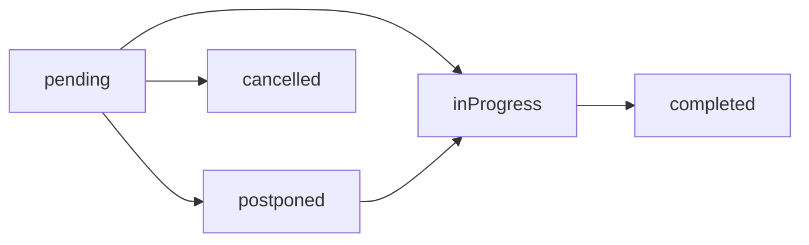

## Overview

Matches are the core entity in Cric PR, representing a cricket game between two teams. The API supports comprehensive match management from creation through completion, including support for multiple match formats and real-time scoring.

## Match Types

Matches can be categorized by their organizational context:

<CardGroup cols={2}>
  <Card title="Friendly Match" icon="handshake">
    Standalone matches between two teams, not part of any tournament structure.
  </Card>
  <Card title="Tournament Match" icon="trophy">
    Matches that are part of a tournament, with results affecting points tables and standings.
  </Card>
</CardGroup>

## Match Formats

The system supports four distinct cricket formats through the `MatchConfig` model:

<Accordion title="T20 (Twenty20)">
  Limited overs format with a maximum of 20 overs per innings.
  
  **Configuration:**
  - `matchType`: `'t20'`
  - `overs`: Maximum 20
  - `noOfDays`: 1
  - `oversPerBowler`: Typically 4
</Accordion>

<Accordion title="ODI (One Day International)">
  Limited overs format with a maximum of 50 overs per innings.
  
  **Configuration:**
  - `matchType`: `'odi'`
  - `overs`: Maximum 50
  - `noOfDays`: 1
  - `oversPerBowler`: Typically 10
</Accordion>

<Accordion title="Test Match">
  Multi-day format with unlimited overs, spanning 1-5 days.
  
  **Configuration:**
  - `matchType`: `'test'`
  - `overs`: Typically 90+ per day
  - `noOfDays`: 1-5
  - `oversPerBowler`: 0 (unlimited)
</Accordion>

<Accordion title="Limited Overs (Custom)">
  Custom limited overs format with configurable parameters.
  
  **Configuration:**
  - `matchType`: `'limitedOvers'`
  - `overs`: Any positive integer
  - `noOfDays`: 1
  - `oversPerBowler`: Configurable
</Accordion>

## Match Configuration Schema

Every match has an associated `MatchConfig` that defines the rules:

```javascript
{
  overs: Number,              // Number of overs per innings
  matchType: String,          // 'test' | 'odi' | 't20' | 'limitedOvers'
  ballType: String,           // 'leather' | 'tennis' | 'other'
  pitchType: String,          // 'rough' | 'cement' | 'turf' | 'astroturf' | 'matting' | 'other'
  noOfDays: Number,           // 1-5 days (for test matches)
  oversPerBowler: Number,     // Maximum overs per bowler (0 = unlimited)
  showWagonWheel: Boolean     // Enable/disable wagon wheel visualization
}
```

<Info>
The `MatchConfig` is created automatically when a match is created and remains immutable during the match to maintain scoring integrity.
</Info>

## Match Lifecycle

Matches progress through a well-defined lifecycle:

### Status Flow



<Accordion title="pending">
  Initial state when a match is created. The match is scheduled but not yet started.
  
  **Characteristics:**
  - Teams can be registered
  - Match details can be modified
  - `isScheduled` flag indicates if start time is in the future
</Accordion>

<Accordion title="inProgress">
  Match is actively being played and scored.
  
  **Triggers:**
  - Toss is conducted
  - First innings is created
  - `isScheduled` is set to `false`
  
  **Operations Available:**
  - Ball-by-ball scoring
  - Player substitutions
  - Innings transitions
</Accordion>

<Accordion title="completed">
  Match has finished, winner determined.
  
  **Automatic Actions:**
  - `endDateTime` is set
  - Tournament points table updated (if tournament match)
  - Match caches invalidated
  - Push notifications sent to players
  - Player milestone notifications triggered
</Accordion>

<Accordion title="cancelled">
  Match was called off before completion.
  
  **Effect:**
  - No winner determined
  - Does not affect tournament standings
</Accordion>

<Accordion title="postponed">
  Match delayed to a future date.
  
  **Characteristics:**
  - Can be rescheduled
  - Can transition to `inProgress` when rescheduled time arrives
</Accordion>

## Team Instances

Matches use a **Team Instance** pattern to capture the specific squad and roles for that particular match:

```javascript
{
  teamId: ObjectId,           // Reference to the base Team
  captainId: ObjectId,        // Captain for this match
  wicketKeeperId: ObjectId,   // Wicket keeper for this match
  scorerId: ObjectId,         // Designated scorer
  players: [ObjectId]         // Playing 11 for this match
}
```

<Note>
Team instances are immutable after match starts to preserve historical accuracy. The same team can have different captains, players, or wicket keepers across different matches.
</Note>

## Match Structure

A match consists of the following key relationships:

```javascript
{
  teamAInstanceId: ObjectId,          // Team A squad
  teamBInstanceId: ObjectId,          // Team B squad
  matchConfigId: ObjectId,            // Match rules
  status: String,                     // Match status
  
  // Toss Details
  tossWinnerTeamInstanceId: ObjectId,
  tossDecision: String,               // 'bat' or 'bowl'
  tossTime: Date,
  
  // Match Result
  winnerTeamInstanceId: ObjectId,
  superOverCount: Number,             // Number of super overs played
  
  // Scheduling
  startdatetime: Date,
  endDateTime: Date,
  isScheduled: Boolean,
  
  // Match Details
  title: String,
  location: String,
  matchCategory: String,
  matchType: String,                  // 'friendly' or 'tournament'
  
  // Officials
  scorerId: ObjectId,
  scorerType: String                  // 'User' or 'Player'
}
```

## Starting a Match

When a match starts via the `/matches/:matchId/start` endpoint:

1. **Toss is conducted**: Winner and decision (bat/bowl) are recorded
2. **Status changes** from `pending` to `inProgress`
3. **First innings created** based on toss decision:
   - If toss winner chose to **bat**: They bat in innings 1
   - If toss winner chose to **bowl**: Opponent bats in innings 1
4. **Day tracking** (for test matches): Current day number is tracked

<Tip>
For test matches, the API automatically manages multi-day tracking through the `Day` model, which tracks sessions and day numbers.
</Tip>

## Innings Structure

Each innings represents one team's batting turn:

```javascript
{
  matchId: ObjectId,
  battingTeamInstanceId: ObjectId,
  bowlingTeamInstanceId: ObjectId,
  inningNumber: Number,               // Auto-incremented per match
  dayNumber: Number,                  // For test matches (1-5)
  status: String,                     // 'inProgress' or 'completed'
  endTime: Date
}
```

<Note>
Inning numbers are auto-incremented per match. Super overs create additional innings beyond the standard 2 or 4 innings.
</Note>

## Ball-by-Ball Scoring

Scoring follows a hierarchical structure:

```
Match
  └─> Innings (1, 2, ...)
       └─> Overs (1, 2, 3, ...)
            └─> Balls (1, 2, 3, 4, 5, 6)
```

### Over Structure

```javascript
{
  overNumber: Number,
  inningId: ObjectId,
  bowlerId: ObjectId,
  ballCount: Number,        // Legal deliveries only
  extrasCount: Number,
  wicketsInOver: Number,
  balls: [ObjectId]
}
```

### Ball Structure

```javascript
{
  overId: ObjectId,
  ballNumber: Number,
  batsmanId: ObjectId,
  nonStrikerId: ObjectId,
  bowlerId: ObjectId,
  
  // Scoring
  runScored: Number,
  isFour: Boolean,
  isSix: Boolean,
  
  // Extras
  extras: Number,
  extraType: String,        // 'noBall' | 'wide' | 'bye' | 'legBye'
  isNoBall: Boolean,
  isLegalDelivery: Boolean,
  isFreeHit: Boolean,
  
  // Dismissals
  wicketPlayerOut: ObjectId,
  dismissalId: ObjectId,
  nextBatsmanId: ObjectId,
  
  // Wagon Wheel (optional)
  direction: String,
  angle: Number,
  distance: Number
}
```

<Info>
**Legal Delivery**: A ball that counts toward the over completion (excludes wides, no-balls, and special dismissals like mankading).
</Info>

## Ending a Match

When a match is completed:

1. Status changes to `completed`
2. `endDateTime` is recorded
3. Match result is calculated
4. **Tournament Integration**: If this is a tournament match, points table is automatically updated
5. **Notifications Sent**:
   - Match end notification to all players
   - Player milestone notifications (centuries, half-centuries, 5-wicket hauls)
   - Player of the Match notification
6. **Cache Invalidation**: All match-related caches are cleared

## Player Milestones

The system automatically detects and notifies players of achievements:

**Batting Milestones:**
- 30+ runs
- Half-century (50+ runs)
- Century (100+ runs)

**Bowling Milestones:**
- 3 wickets
- Fifer (5+ wickets)

**Match Award:**
- Player of the Match (calculated based on batting + bowling performance)

## Related Endpoints

See the [Match API Reference](/api/matches/overview) for detailed endpoint documentation:

- `POST /matches` - Create a match
- `GET /matches/:id` - Get match details
- `PATCH /matches/:id` - Update match
- `POST /matches/:id/start` - Start a match
- `POST /matches/:id/end` - End a match
- `GET /matches/:id/stats` - Get match statistics