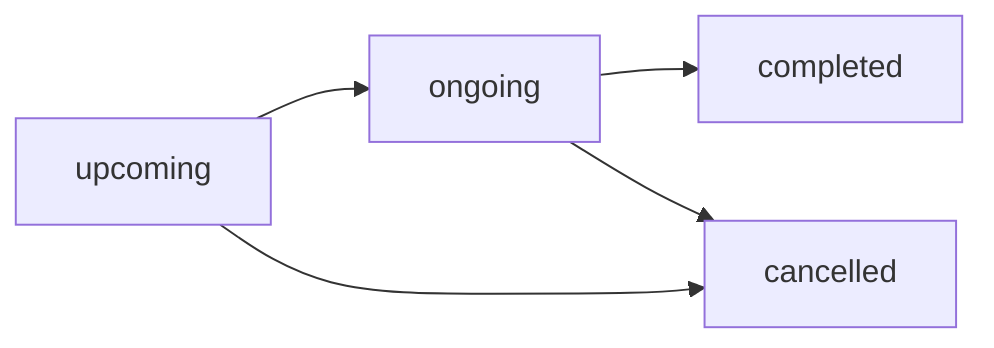

## Overview

Tournaments in Cric PR provide a comprehensive framework for organizing multi-team cricket competitions with flexible formats, group stages, and automatic points table management.

## Tournament Formats

The API supports four tournament formats:

<CardGroup cols={2}>
  <Card title="Round Robin" icon="arrows-rotate">
    Every team plays every other team. Common in league-style tournaments.
  </Card>
  <Card title="Knockout" icon="trophy">
    Single-elimination format where losing teams are eliminated.
  </Card>
  <Card title="Hybrid" icon="sitemap">
    Combination of group stages (round robin) followed by knockout phases.
  </Card>
  <Card title="Point Based" icon="ranking-star">
    Teams earn points for wins, draws, and other achievements.
  </Card>
</CardGroup>

## Tournament Schema

```javascript
{
  name: String,
  coverImage: String,
  banner: String,
  city: String,
  
  // Dates
  startDate: Date,
  endDate: Date,
  registrationDeadline: Date,
  
  // Structure
  format: String,              // 'round_robin' | 'knockout' | 'hybrid' | 'point_based'
  maxTeams: Number,
  currentTeamsCount: Number,
  teamIds: [ObjectId],
  
  // Organizer
  organizerType: String,       // 'User' | 'Player'
  organizerId: ObjectId,
  
  // Status
  status: String,              // 'upcoming' | 'ongoing' | 'completed' | 'cancelled'
  
  // Optional
  description: String,
  prize: String,
  entryFee: Number,
  isPublic: Boolean,
  winnerTeamId: ObjectId
}
```

## Tournament Hierarchy

Tournaments use a hierarchical structure to support complex competition formats:

```
Tournament
  └─> Stage 1 (e.g., "Group Stage")
       ├─> Group A
       │    ├─> Team 1
       │    ├─> Team 2
       │    └─> Team 3
       └─> Group B
            ├─> Team 4
            ├─> Team 5
            └─> Team 6
  └─> Stage 2 (e.g., "Semi Finals")
       └─> No Groups (Knockout)
  └─> Stage 3 (e.g., "Final")
       └─> No Groups
```

## Tournament Stages

Stages allow tournaments to progress through different phases (e.g., group stage → semi-finals → final).

### Stage Schema

```javascript
{
  tournamentId: ObjectId,
  name: String,                // e.g., "Group Stage", "Quarter Finals"
  stageOrder: Number,          // Sequential order (1, 2, 3...)
  format: String,              // 'round_robin' | 'knockout' | 'point_based'
  status: String,              // 'upcoming' | 'ongoing' | 'completed'
  
  // Group Configuration
  hasGroups: Boolean,
  numberOfGroups: Number,
  teamsPerGroup: Number,
  advancingTeamsPerGroup: Number,
  
  // Points System
  pointsForWin: Number,        // Default: 2
  pointsForDraw: Number,       // Default: 1
  pointsForLoss: Number,       // Default: 0
  pointsForNoResult: Number,   // Default: 1
  
  description: String
}
```

<Accordion title="Round Robin Stages">
  All teams in a group play each other once (or twice for home-and-away).
  
  **Use Case:** Group stages where you want to ensure every team plays multiple matches.
  
  **Configuration:**
  - Set `format: 'round_robin'`
  - Enable `hasGroups: true` for multiple parallel groups
  - Define `teamsPerGroup` and `advancingTeamsPerGroup`
</Accordion>

<Accordion title="Knockout Stages">
  Single elimination format - lose and you're out.
  
  **Use Case:** Semi-finals, quarter-finals, finals.
  
  **Configuration:**
  - Set `format: 'knockout'`
  - Typically `hasGroups: false`
  - Matches are manually scheduled based on previous stage results
</Accordion>

<Accordion title="Point Based Stages">
  Teams accumulate points based on match results.
  
  **Use Case:** League-style competitions with flexible point allocation.
  
  **Configuration:**
  - Set `format: 'point_based'`
  - Customize point values for different outcomes
</Accordion>

## Tournament Groups

Groups subdivide a stage into parallel competitions (e.g., Group A, Group B).

### Group Schema

```javascript
{
  tournamentId: ObjectId,
  stageId: ObjectId,
  groupName: String,           // e.g., "Group A", "Pool B"
  groupOrder: Number,          // Sequential order within stage
  currentTeamsCount: Number,
  status: String               // 'active' | 'completed'
}
```

<Info>
Groups are unique per stage. You cannot have duplicate group names or orders within the same stage.
</Info>

## Points Table

The points table tracks team performance within a stage/group and automatically calculates standings.

### Points Table Schema

```javascript
{
  tournamentId: ObjectId,
  stageId: ObjectId,
  groupId: ObjectId,           // Optional, for grouped stages
  teamId: ObjectId,
  tournamentTeamId: ObjectId,
  
  // Standings
  position: Number,
  points: Number,
  netRunRate: Number,          // Automatically calculated
  
  // Match Stats
  matchesPlayed: Number,
  matchesWon: Number,
  matchesLost: Number,
  matchesDrawn: Number,
  matchesNoResult: Number,
  
  // Scoring Stats
  totalRunsScored: Number,
  totalRunsConceded: Number,
  totalOversPlayed: Number,
  totalOversFaced: Number,
  totalWicketsLost: Number,
  totalWicketsTaken: Number,
  
  // Performance Indicators
  highestScore: Number,
  lowestScore: Number,
  winStreak: Number,
  form: String,                // e.g., "WWLWL" (last 5 matches)
  
  // Super Over
  superOverWins: Number,
  superOverLosses: Number,
  
  // Qualification
  qualificationStatus: String, // 'qualified' | 'eliminated' | 'pending'
  tieBreakingFactor: Number
}
```

## Net Run Rate Calculation

Net Run Rate (NRR) is automatically calculated and used as a tie-breaker:

```
NRR = (Total Runs Scored / Total Overs Played) - (Total Runs Conceded / Total Overs Faced)
```

<Note>
The NRR is recalculated automatically whenever a tournament match is completed via a pre-save hook on the `TournamentPointsTable` model.
</Note>

## Points Table Ranking

Teams are ranked using the following criteria (in order):

1. **Points** (descending)
2. **Net Run Rate** (descending)
3. **Total Runs Scored** (descending)
4. **Matches Won** (descending)

## Tournament Matches

Tournament matches link regular matches to the tournament structure:

```javascript
{
  tournamentId: ObjectId,
  stageId: ObjectId,
  groupId: ObjectId,           // Optional
  matchId: ObjectId,           // Reference to Match
  teamAId: ObjectId,           // Tournament team A
  teamBId: ObjectId,           // Tournament team B
  matchNumber: Number,
  round: String,               // e.g., "Round 1", "Semi Final"
  venue: String,
  scheduledTime: Date
}
```

<Tip>
When a tournament match is completed, the system automatically updates the points table for the relevant stage/group.
</Tip>

## Tournament Team vs Team

There's an important distinction:

<CardGroup cols={2}>
  <Card title="Team" icon="users">
    Base team entity with permanent roster of players.
    
    **Reference:** `/api-reference/teams`
  </Card>
  <Card title="Tournament Team" icon="id-badge">
    Team registration for a specific tournament. Links a base team to a tournament.
  </Card>
</CardGroup>

### Tournament Team Schema

```javascript
{
  tournamentId: ObjectId,
  teamId: ObjectId,            // Reference to base Team
  registrationDate: Date,
  status: String,              // 'registered' | 'confirmed' | 'withdrawn'
  groupId: ObjectId            // Assigned group (if applicable)
}
```

## Automatic Points Table Updates

When a tournament match is completed:

1. **Match result is calculated** based on innings scores
2. **Points are awarded** according to stage configuration:
   - Win: `pointsForWin` (default: 2)
   - Draw/Tie: `pointsForDraw` (default: 1)
   - Loss: `pointsForLoss` (default: 0)
   - No Result: `pointsForNoResult` (default: 1)
3. **Statistics are updated**:
   - Matches played, won, lost, drawn
   - Runs scored/conceded
   - Overs played/faced
   - Wickets lost/taken
4. **NRR is recalculated** automatically
5. **Positions are updated** based on ranking criteria

## Tournament Status Lifecycle



<Accordion title="upcoming">
  Tournament is scheduled but registration/matches haven't started.
  
  **Actions Available:**
  - Team registration
  - Stage/group creation
  - Match scheduling
</Accordion>

<Accordion title="ongoing">
  Tournament is actively running with matches in progress.
  
  **Characteristics:**
  - Matches can be played
  - Points tables are live
  - No new team registrations (typically)
</Accordion>

<Accordion title="completed">
  All matches finished, winner determined.
  
  **Set:**
  - `winnerTeamId` is assigned
  - Final standings are frozen
</Accordion>

<Accordion title="cancelled">
  Tournament was called off.
  
  **Effect:**
  - All scheduled matches are typically cancelled
  - No winner declared
</Accordion>

## Tournament Player Statistics

The system maintains aggregated player statistics across all tournament matches:

```javascript
{
  tournamentId: ObjectId,
  playerId: ObjectId,
  teamId: ObjectId,
  
  // Batting
  matchesPlayed: Number,
  innings: Number,
  runs: Number,
  highestScore: Number,
  average: Number,
  strikeRate: Number,
  fifties: Number,
  hundreds: Number,
  
  // Bowling
  wickets: Number,
  economy: Number,
  bestFigures: String,
  
  // Fielding
  catches: Number,
  stumpings: Number,
  runOuts: Number
}
```

## Creating a Tournament Workflow

1. **Create Tournament** → `POST /tournaments`
2. **Create Stages** → `POST /tournaments/:id/stages`
   - Define stage order and format
3. **Create Groups (if needed)** → `POST /tournaments/:id/stages/:stageId/groups`
4. **Register Teams** → `POST /tournaments/:id/teams`
5. **Assign Teams to Groups** → `POST /tournaments/:id/groups/:groupId/teams`
6. **Schedule Matches** → `POST /tournaments/:id/matches`
7. **Update Status to Ongoing** → `PATCH /tournaments/:id`

<Info>
Points table entries are created automatically when teams are assigned to groups.
</Info>

## Related Endpoints

See the API Reference for detailed endpoint documentation:

- `POST /tournaments` - Create tournament
- `GET /tournaments/:id` - Get tournament details
- `POST /tournaments/:id/stages` - Create stage
- `POST /tournaments/:id/groups` - Create group
- `GET /tournaments/:id/points-table` - Get points table
- `POST /tournaments/:id/matches` - Schedule tournament match